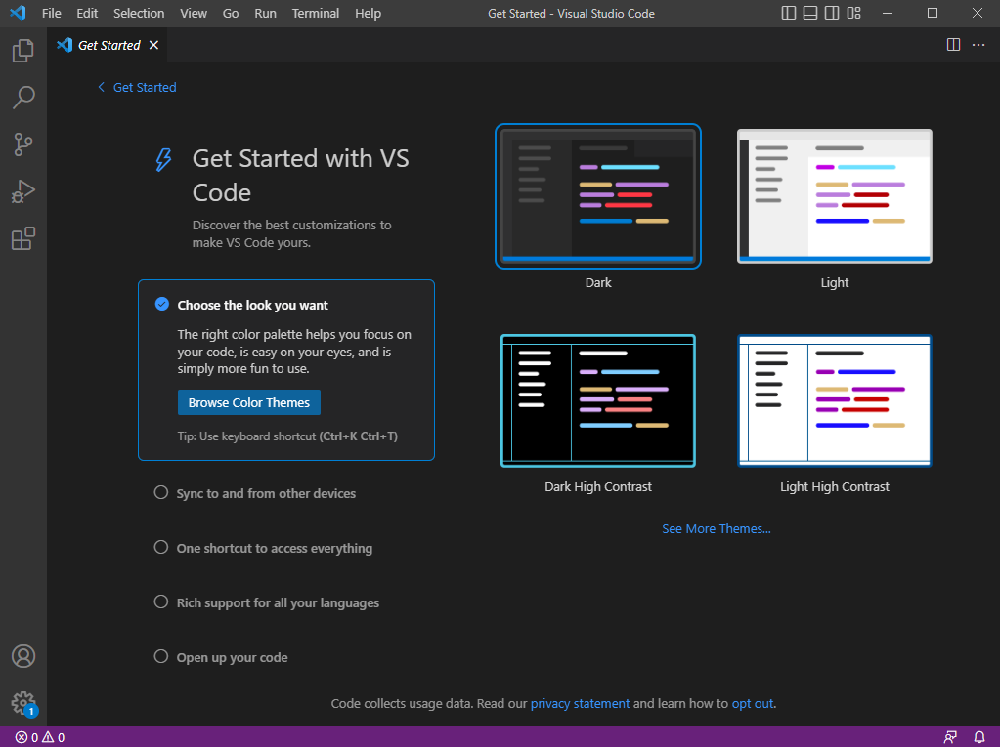
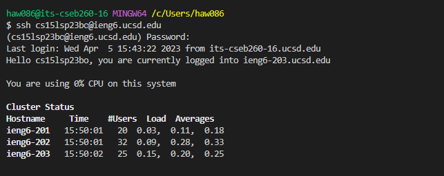
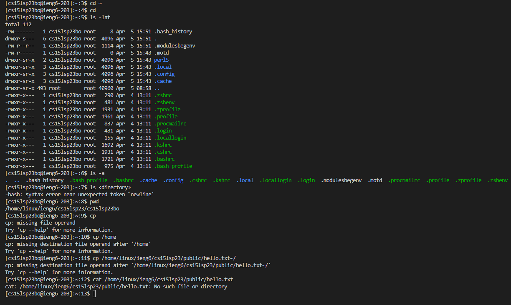

Part 1 – Meet Your Group!

I meet my 5 groupmembers! They all use their own computer, but I'm using school's computer.

Part 2 – Your CSE15L Account

I created my account and transfer to CSE unique account, then reset password.

Part 3 – Visual Studio Code

I tried to installed the Visual Studio and GitBash. But since I'm using the school's computer I don't need to install it.

Part 4 – Remotely Connecting

I failed on remote due on the first try because I didn't open GitBash inside of the VS. But I still successfully did it in the GitBash, then I realize I don't need to verify it again in the VS.

Part 5 – Run Some Commands

I run most of the codes successfully, but there are some problems happened at the last few codes. The files doesn't exist, so the last few codes didn't run successfully, tutor said we don't need to worry about it now.

Part 6 – git, Github, and Github Pages

Part 7 – Creating a Website with Github Pages

Github is really useful, I created an account and a web page.
