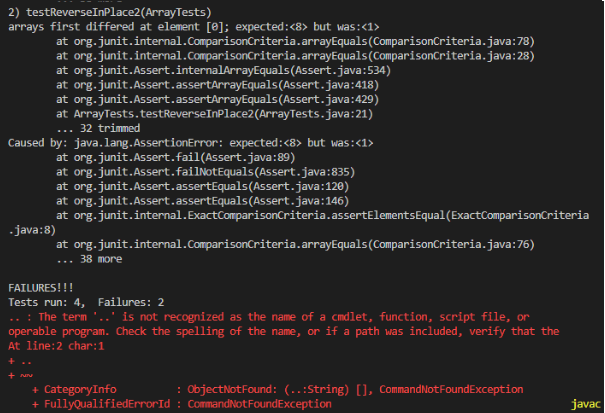
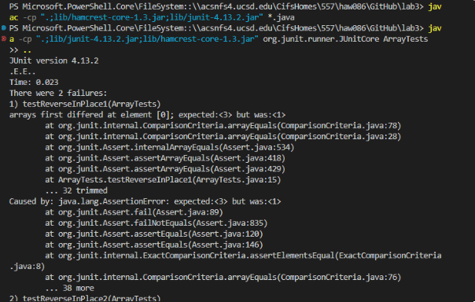

# Part 1


# Part 2
The bug I choose is the one makes me most confuse. After I fix the bug which inside of the code and link new code to lancher, the output still wired.

## Provide:

1. A failure-inducing input for the buggy program, as a JUnit test and any associated code (write it as a code block in Markdown):
```
ArrayExamles.java: 
static int[] reversed(int[] arr) {
    int[] newArray = new int[arr.length];
    for(int i = 0; i < arr.length; i += 1) {
      newArray[i] = arr[arr.length - i - 1];
    }
    return newArray;
  }

ArrayTests.java:
  @Test
  public void testReverseInPlace1() {
    int[] input2 = { 1,2,3 };
    ArrayExamples.reversed(input2);
    assertArrayEquals(new int[]{ 3,2,1 }, input2);
  }
  @Test
  public void testReverseInPlace2() {
    int[] input2 = { 1,2,3,4,5,6,7,8 };
    ArrayExamples.reversed(input2);
    assertArrayEquals(new int[]{ 8,7,6,5,4,3,2,1 }, input2);
  }
```

2. An input that doesn’t induce a failure, as a JUnit test and any associated code (write it as a code block in Markdown):
```
ArrayExamles.java: 
static int[] reversed(int[] arr) {
    int[] newArray = new int[arr.length];
    for(int i = 0; i < arr.length; i += 1) {
      newArray[i] = arr[arr.length - i - 1];
    }
    return newArray;
  }

ArrayTests.java:
  @Test
  public void testReverseInPlace() {
    int[] input1 = { 3 };
    ArrayExamples.reversed(input1);
    assertArrayEquals(new int[]{ 3 }, input1);
  }
  @Test
  public void testReversed() {
    int[] input1 = { };
    assertArrayEquals(new int[]{ }, ArrayExamples.reversed(input1));
  }
}

```

3. The symptom, as the output of running the tests (provide it as a screenshot of running JUnit with at least the two inputs above):



4. The bug, as the before-and-after code change required to fix it (as two code blocks in Markdown):

Incorrect:
```
public void testReverseInPlace1() {
    int[] input2 = { 1,2,3 };
    ArrayExamples.reversed(input2);
    assertArrayEquals(new int[]{ 3,2,1 }, input2);
  }
  @Test
  public void testReverseInPlace2() {
    int[] input2 = { 1,2,3,4,5,6,7,8 };
    ArrayExamples.reversed(input2);
    assertArrayEquals(new int[]{ 8,7,6,5,4,3,2,1 }, input2);
  }
```

Correct:
```
@Test
  public void testReverseInPlace1() {
    int[] input2 = { 1,2,3 };
   
    assertArrayEquals(new int[]{ 3,2,1 }, ArrayExamples.reversed(input2));
  }
  @Test
  public void testReverseInPlace2() {
    int[] input2 = { 1,2,3,4,5,6,7,8 };
   
    assertArrayEquals(new int[]{ 8,7,6,5,4,3,2,1 }, ArrayExamples.reversed(input2));
  }
```

5. Briefly describe why the fix addresses the issue.:
The problem with this Code is the output of the ArrayExample.reversed didn’t be the input of assertArrayEquals correctly. The ArrayExample.reversed finished its job, but the assertArrayEqualsdidn’t took  ArrayExample.reversed’s output as input but took the original input as input. 


# Part 3
In a couple of sentences, describe something you learned from lab in week 2 or 3 that you didn’t know before.
