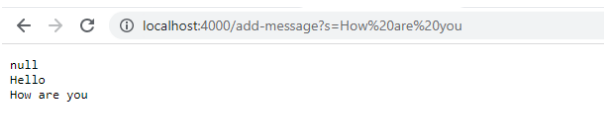
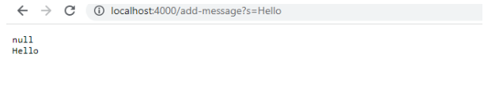

# Part 1
```
import java.io.IOException;
import java.net.URI;


class Handler implements URLHandler {


    String result;


    public String handleRequest(URI url) {
        if (url.getPath().equals("/add-message")) {
            String[] parameters = url.getQuery().split("=");
            result +='\n' +parameters[1];
            return result;
        }
        else {
            return "404 Not Found!";
        }
    }
}


class NumberServer {
    public static void main(String[] args) throws IOException {
        if(args.length == 0){
            System.out.println("Missing port number! Try any number between 1024 to 49151");
            return;
        }


        int port = Integer.parseInt(args[0]);


        Server.start(port, new Handler());
    }
}
```

My code use if to determine is the URL ask for add message, then use String to add them together.
My method contains parameters which is "Hello", result is empty.
And result is empty, being add '\n' and "Hello" into it, then return result.


My code use if to determine is the URL ask for add message, then use String to add them together.
My method contains parameters which is "How are you", result is "Hello".
And result is "Hello", and being add '\n' and "How are you" into it, then become"Hello \n How are you", then finally return result


# Part 2
The bug I choose is the one makes me most confuse. After I fix the bug which inside of the code and link new code to lancher, the output still wired.

## Provide:

1. A failure-inducing input for the buggy program, as a JUnit test and any associated code (write it as a code block in Markdown):

```
ArrayExamles.java: 
static int[] reversed(int[] arr) {
    int[] newArray = new int[arr.length];
    for(int i = 0; i < arr.length; i += 1) {
      newArray[i] = arr[arr.length - i - 1];
    }
    return newArray;
  }

ArrayTests.java:
  @Test
  public void testReverseInPlace1() {
    int[] input2 = { 1,2,3 };
    ArrayExamples.reversed(input2);
    assertArrayEquals(new int[]{ 3,2,1 }, input2);
  }
  @Test
  public void testReverseInPlace2() {
    int[] input2 = { 1,2,3,4,5,6,7,8 };
    ArrayExamples.reversed(input2);
    assertArrayEquals(new int[]{ 8,7,6,5,4,3,2,1 }, input2);
  }
```

2. An input that doesn’t induce a failure, as a JUnit test and any associated code (write it as a code block in Markdown):

```
ArrayExamles.java: 
static int[] reversed(int[] arr) {
    int[] newArray = new int[arr.length];
    for(int i = 0; i < arr.length; i += 1) {
      newArray[i] = arr[arr.length - i - 1];
    }
    return newArray;
  }

ArrayTests.java:
  @Test
  public void testReverseInPlace() {
    int[] input1 = { 3 };
    ArrayExamples.reversed(input1);
    assertArrayEquals(new int[]{ 3 }, input1);
  }
  @Test
  public void testReversed() {
    int[] input1 = { };
    assertArrayEquals(new int[]{ }, ArrayExamples.reversed(input1));
  }
}
```

3. The symptom, as the output of running the tests (provide it as a screenshot of running JUnit with at least the two inputs above):


4. The bug, as the before-and-after code change required to fix it (as two code blocks in Markdown):

Incorrect:

```
public void testReverseInPlace1() {
    int[] input2 = { 1,2,3 };
    ArrayExamples.reversed(input2);
    assertArrayEquals(new int[]{ 3,2,1 }, input2);
  }
  @Test
  public void testReverseInPlace2() {
    int[] input2 = { 1,2,3,4,5,6,7,8 };
    ArrayExamples.reversed(input2);
    assertArrayEquals(new int[]{ 8,7,6,5,4,3,2,1 }, input2);
  }
```

Correct:

```
@Test
  public void testReverseInPlace1() {
    int[] input2 = { 1,2,3 };
   
    assertArrayEquals(new int[]{ 3,2,1 }, ArrayExamples.reversed(input2));
  }
  @Test
  public void testReverseInPlace2() {
    int[] input2 = { 1,2,3,4,5,6,7,8 };
   
    assertArrayEquals(new int[]{ 8,7,6,5,4,3,2,1 }, ArrayExamples.reversed(input2));
  }
```

5. Briefly describe why the fix addresses the issue.:

The problem with this Code is the output of the ArrayExample.reversed didn’t be the input of assertArrayEquals correctly. The ArrayExample.reversed finished its job, but the assertArrayEqualsdidn’t took  ArrayExample.reversed’s output as input but took the original input as input. 


# Part 3
In a couple of sentences, describe something you learned from lab in week 2 or 3 that you didn’t know before.
