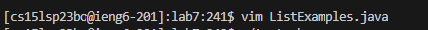

## 4.Log into ieng6

I pressed ssh cse15lsp23bo@ieng6.ucsd.edu, and then <enter>. This time I directly log in without ask for password since I set the SSH key. The input is to show the account name I am tring to log in, then enter to ensure. 

  
## 5.Clone your fork of the repository from your Github account

  
  
I preeesed git clone https://github.com/ucsd-cse15l-s23/lab7 , end with <enter>. This is to clone the files, since I have done this in the lab, it shows I already exists.
  
  
## 6.Run the tests, demonstrating that they fail

  
  
First I eneter chmod +x test.sh , end with<enter> , this is add the executable permission to sh file, then run it. 
  
  
Then I enter ./test.sh , end with<enter> , to test. I came with ERROR. I also could us javac and java to test it.

## 7.Edit the code file ListExamples.java to fix the failing test (as a reminder, the error in the code is just that index1 is used instead of index2 in the final loop in merge)

  
  
First I enter vim ListExamples.java ,end with<enter>. This is to enter the vim mode of the file to make change
  

  
  
Then I enter 43j : to jump to the 43th line
  
  
12l : to jump to the 12th characters
  
  
x : to delete the current character
  
  
i : enter the edit mode
  
  
2 : add "2"
  
  
esc : exist the edit mode
  
  
:wq : save the change and quit

  
## 8.Run the tests, demonstrating that they now succeed

  
  
Then I enter ./test.sh ,end with<enter>. This is to run the test.sh under the current file.
  
## 9.Commit and push the resulting change to your Github account

  
  
First I enter git add ListExamples.java,end with<enter>. To add java file. 
  

Then I enter git commit -m "edited",end with<enter>.  To commit it. 
  
  
Then I enter  git push origin main,end with<enter>. To push it. Finally with my username and password.
