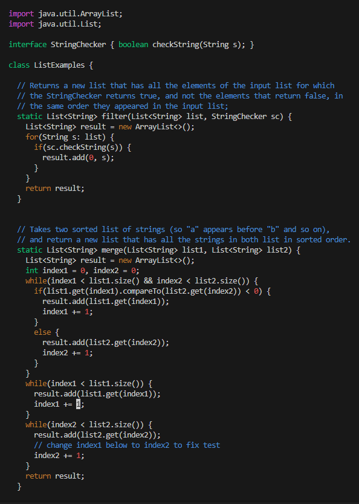
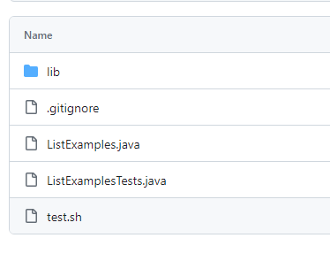
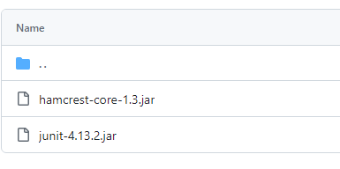
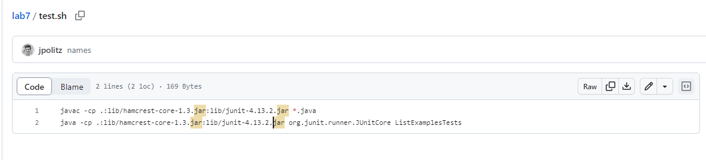
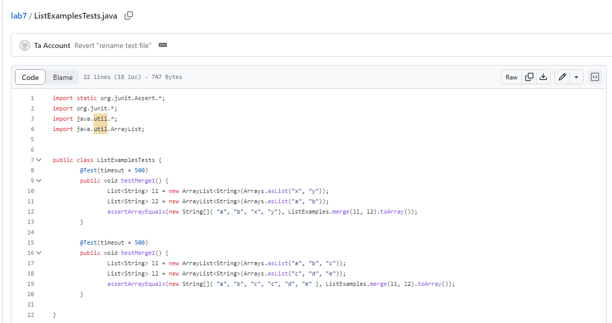
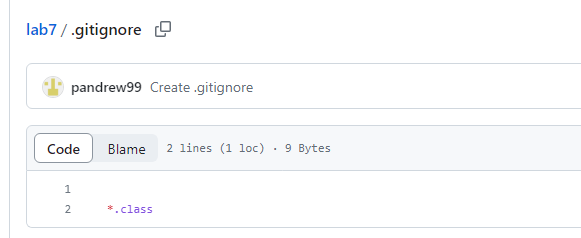
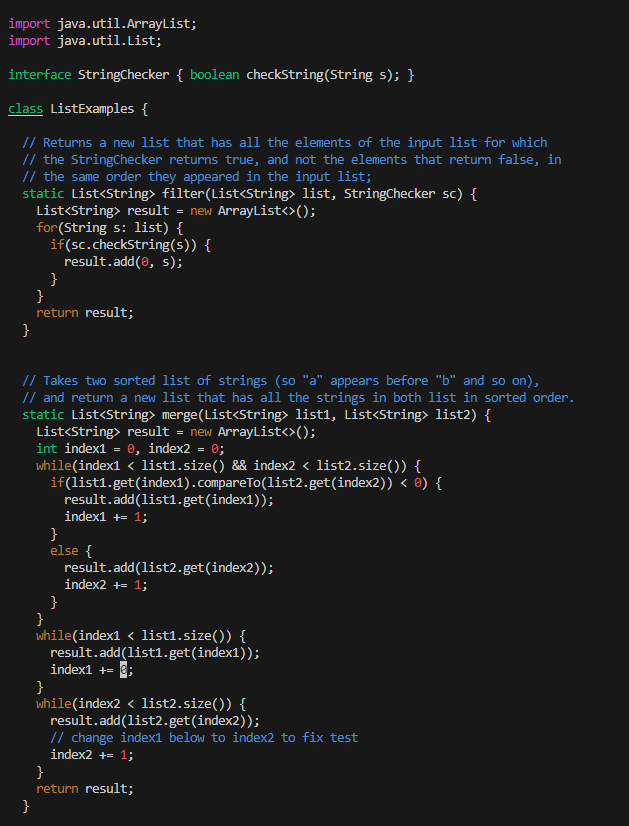
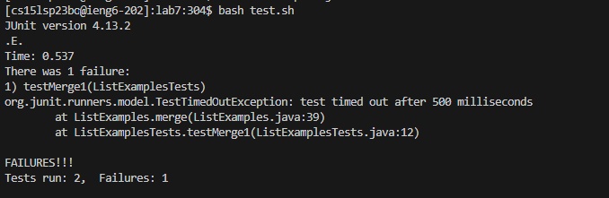
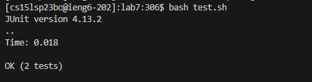

## Part 1 – Debugging Scenario

# 1. original post :

# 1. A response from a TA

The picture of code is incomplete and it is blocked, and description is not detail enough. If you could provid more detailed information with clear unblocked picture of complete code would be helpful. But base on the information, you might in an infinite loop to cause a timout. Therefore, you might want to check your every loop's ending.

# 2. Another screenshot/terminal output showing what information the student got

Thank you for the help, I apologize for the unclear description and picture. I have rechecked all of my loops, there is one have "+0" instead of "+1", therefore, the loop will never end since the value is not increasing.

# 3. At the end, all the information needed about the setup

The file & directory structure needed:

The contents of each file before fixing the bug:

The full command line (or lines) you ran to trigger the bug:

The success code and terminal command after fix the bug:

A description of what to edit to fix the bug:

The index1 has been added 0 instead of add 1, therefore the value of index1 will never change, then the loop will infinity running. Until the timout, then the system give out an Error. The fix is to change 0 to 1 to add value to index1 to make everthing work and end the loop properly.

## Part 2 – Reflection
